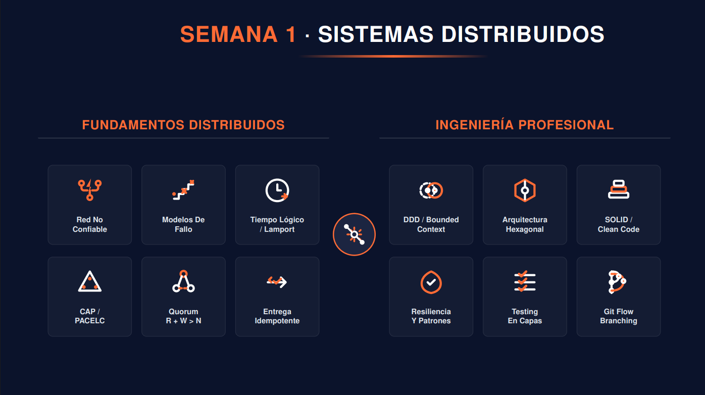

<!-- HU-STATUS TEMPLATE - do NOT remove the <!-- ... --> markers or the table headers.
     Your weekly grade is read AUTOMATICALLY from this file:
       01-week/hu-status/README.md  (inside YOUR fork). English. -->

# Weekly Status - Week 01

<!-- CONFIG-START - must match your profile repo (username/username) CONFIG -->
- FULL_NAME: Carlos Mauricio Leal Medins
- GITHUB_USER: carlosleal16
- TEAM: Barbersaas
- SPRINT_GOAL: Project Start, PDR Submission
<!-- CONFIG-END -->

## 1. User stories worked this week
| HU ID | Title | Status (todo/doing/done) | Evidence (PR or commit URL) |
|---|---|---|---|
| HU-XXX-001 | NONE | NONE | NONE |

## 2. My individual contribution
- I met with my team, and we reviewed the project so we could begin working on the PDR
- Contributing ideas and suggestions for improvements to the project

## 3. Blockers and risks
- Lack of information at the start of the project
- Communication within the team

## 4. Plan for next week
- Follow the project's step-by-step guide to stay organized
- Consider what ideas or improvements could be added to the project

## 5. Compliance self-check
- [ ] Conventional Commits - `type(scope): summary`
- [ ] Per-environment HU branch + PR to that environment (hu-xxx-dev -> develop, ...)
- [X] Testable acceptance criteria
- [ ] Tests added/updated (unit / integration)
- [ ] DDD / hexagonal boundaries respected (domain has no I/O)
- [ ] No secrets; config via environment variables

## 6. Evidence links
-

[Ver PDR - BarberSaaS](PDR-BarberSaaS.md)

