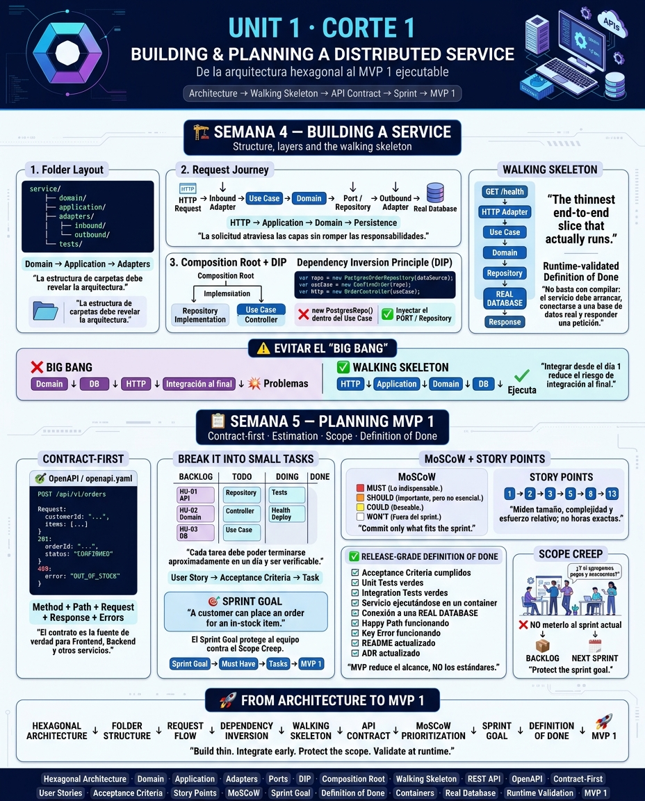

<!-- HU-STATUS TEMPLATE - do NOT remove the <!-- ... --> markers or the table headers.
     Your weekly grade is read AUTOMATICALLY from this file:
       04-week/hu-status/README.md  (inside YOUR fork). English. -->

# Weekly Status - Week 04

<!-- CONFIG-START - must match your profile repo (username/username) CONFIG -->
- FULL_NAME: Carlos Mauricio Leal Medina
- GITHUB_USER: carlosleal16
- TEAM: Barberssas
- SPRINT_GOAL: Build the Payment Service walking skeleton following hexagonal architecture and prepare its RabbitMQ integration and resilience strategy for MVP 1.
<!-- CONFIG-END -->

## 1. User stories worked this week

| HU ID | Title | Status (todo/doing/done) | Evidence (PR or commit URL) |
|---|---|---|---|
| HU-XXX-001 | As a developer, I want to structure the Payment Service following hexagonal architecture, separating domain, application and adapters, so that the service remains maintainable and decoupled. | doing | [PR/Commit URL] |
| HU-XXX-002 | As a developer, I want to implement the basic payment registration flow, so that payments associated with appointments can be managed by the Payment Service. | doing | [PR/Commit URL] |
| HU-XXX-003 | As a developer, I want to prepare RabbitMQ communication in the Payment Service, so that it can consume `CitaCreada` events and publish `PagoProcesado` or `PagoFallido`. | doing | [PR/Commit URL] |
| HU-XXX-004 | As a developer, I want to define the Circuit Breaker strategy for the Payment Service, so that failures in the Notification Service do not block the payment flow. | todo | [PR/Commit URL] |

## 2. My individual contribution
- Defined the initial structure of the Payment Service according to the Hexagonal Architecture approach.
- Separated the service into the main architectural concerns: domain, application and adapters.
- Defined the basic payment flow and its relationship with the appointment process described in the PDR.
- Identified the asynchronous communication requirements between the Payment Service and the other services through RabbitMQ.
- Defined the events that participate in the distributed flow: CitaCreada, PagoProcesado and PagoFallido.

## 3. Blockers and risks
- The Payment Service depends on the final definition of the event contracts used by RabbitMQ.
- Integration with RabbitMQ must be validated with the other services to ensure that producers and consumers use compatible event structures.
- The Circuit Breaker configuration still needs to be validated through failure scenarios involving the Notification Service.
- There is a risk of integration problems if the services are developed independently without validating the distributed flow from an early stage.
- The project has a limited development time, so the MVP scope must remain controlled and focused on the functionality defined in the PDR.

## 4. Plan for next week
- Continue the implementation of the Payment Service based on the defined hexagonal structure.
- Complete the payment registration and persistence flow using MongoDB.
- Implement the RabbitMQ consumer for the CitaCreada event.
- Implement the publication of PagoProcesado and PagoFallido events.
- Integrate the Payment Service with the distributed appointment-to-payment flow.
- Implement and configure the Circuit Breaker with Resilience4j.
- Add unit and integration tests for the payment flow and RabbitMQ communication.
- Validate the service inside a Docker container using its own MongoDB instance.
- Verify the happy path and payment failure scenarios.

## 5. Compliance self-check
- [X] Conventional Commits - `type(scope): summary`
- [X] Per-environment HU branch + PR to that environment (hu-xxx-dev -> develop, ...)
- [X] Testable acceptance criteria
- [ ] Tests added/updated (unit / integration)
- [X] DDD / hexagonal boundaries respected (domain has no I/O)
- [X] No secrets; config via environment variables

## 6. Evidence links
- - 

- https://github.com/carlosleal16/sistemas-distribuidos-2026-b-g2-carlos-mauricio-leal-medina.git

