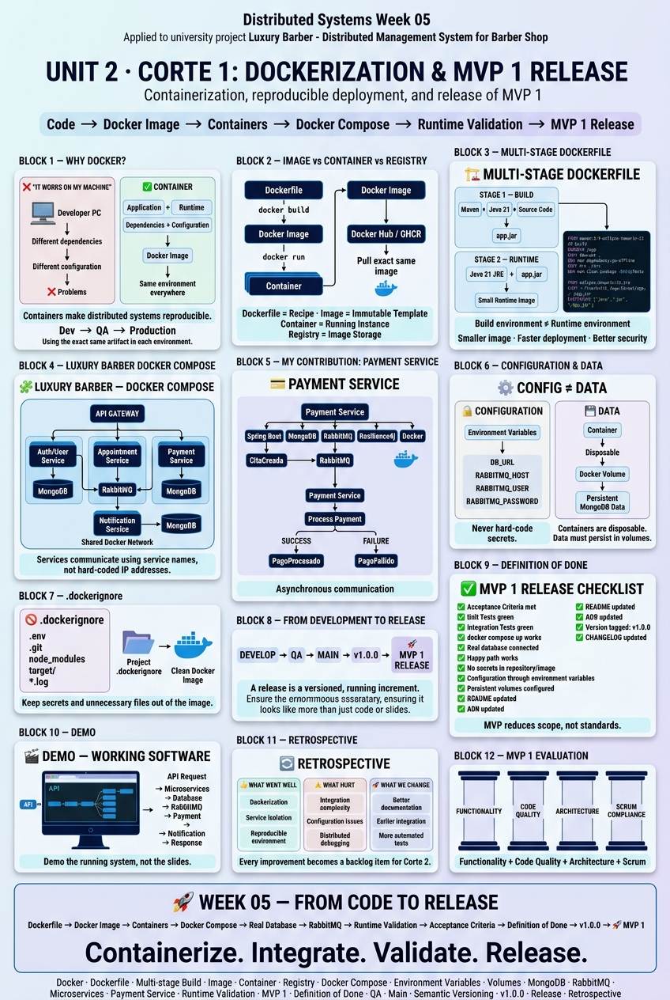

<!-- HU-STATUS TEMPLATE - do NOT remove the <!-- ... --> markers or the table headers.
     Your weekly grade is read AUTOMATICALLY from this file:
       05-week/hu-status/README.md  (inside YOUR fork). English. -->

# Weekly Status - Week 05

<!-- CONFIG-START - must match your profile repo (username/username) CONFIG -->
- FULL_NAME: Carlos Mauricio Leal Medina
- GITHUB_USER: carlosleal16
- TEAM: Barberssas
- SPRINT_GOAL: Build the Payment Service walking skeleton following hexagonal architecture and prepare its RabbitMQ integration and resilience strategy for MVP 1.
<!-- CONFIG-END -->

## 1. User stories worked this week

| HU ID | Title | Status (todo/doing/done) | Evidence (PR or commit URL) |
|---|---|---|---|
| HU-XXX-001 | As a developer, I want to containerize the Payment Service, so that it can run consistently across different environments. | doing | [PR/Commit URL] |
| HU-XXX-002 | As a developer, I want to create a multi-stage Dockerfile for the Payment Service, so that the service is packaged in a lightweight and reproducible runtime image. | doing | [PR/Commit URL] |
| HU-XXX-003 | As a developer, I want to configure the Payment Service in Docker Compose with its MongoDB instance, so that the service and its database can run together in an isolated environment. | doing | [PR/Commit URL] |
| HU-XXX-004 | As a developer, I want to configure environment variables and persistent volumes, so that sensitive configuration is not stored in the image and database data survives container restarts. | doing | [PR/Commit URL] |
| HU-XXX-005 | As a developer, I want to validate the Payment Service in the MVP 1 release environment, so that its main functionality can be demonstrated as running software. | doing | [PR/Commit URL] |

## 2. My individual contribution

- Containerized the **Payment Service** using Docker.
- Prepared the Docker configuration following a **multi-stage build** approach to separate the build environment from the runtime environment.
- Configured the Payment Service to run together with its **MongoDB database** using Docker Compose.
- Configured environment variables for database connection and service configuration instead of hard-coding sensitive or environment-specific values.
- Defined persistent storage through Docker volumes for the Payment Service database.
- Prepared the service to communicate with other containers through Docker Compose service names instead of hard-coded IP addresses.
- Added the necessary `.dockerignore` configuration to prevent unnecessary files, secrets and development artifacts from being included in the Docker image.
- Validated that the Payment Service can start correctly inside a container and connect to its real MongoDB instance.
- Contributed to the validation of the Payment Service as part of the **MVP 1 release**.
- Reviewed the release requirements related to Docker, runtime validation, acceptance criteria and Definition of Done.

## 3. Blockers and risks

- The Payment Service depends on the correct configuration of MongoDB and the Docker Compose network.
- RabbitMQ integration requires all participating services to use compatible container network configurations and environment variables.
- The distributed payment flow must be validated with the other services running simultaneously.
- There is a risk of configuration problems between local execution and Docker execution if environment-specific values are hard-coded.
- The MVP 1 release depends on all services being able to start correctly through Docker Compose.
- The Circuit Breaker and RabbitMQ failure scenarios still require runtime validation as part of the distributed integration.

## 4. Plan for next week

- Continue validating the Payment Service within the complete distributed environment.
- Validate the RabbitMQ communication between Appointment Service and Payment Service.
- Test the `CitaCreada` event consumption and the `PagoProcesado` / `PagoFallido` event publication.
- Validate payment persistence in MongoDB.
- Test the Circuit Breaker behavior when the Notification Service becomes unavailable.
- Add or complete unit and integration tests for the Payment Service.
- Validate the complete distributed flow using Docker Compose.

## 5. Compliance self-check

- [x] Conventional Commits - `type(scope): summary`
- [ ] Per-environment HU branch + PR to that environment (hu-xxx-dev -> develop, ...)
- [x] Testable acceptance criteria
- [ ] Tests added/updated (unit / integration)
- [x] DDD / hexagonal boundaries respected (domain has no I/O)
- [x] No secrets; config via environment variables

## 6. Evidence links

- 

- https://github.com/carlosleal16/sistemas-distribuidos-2026-b-g2-carlos-mauricio-leal-medina.git