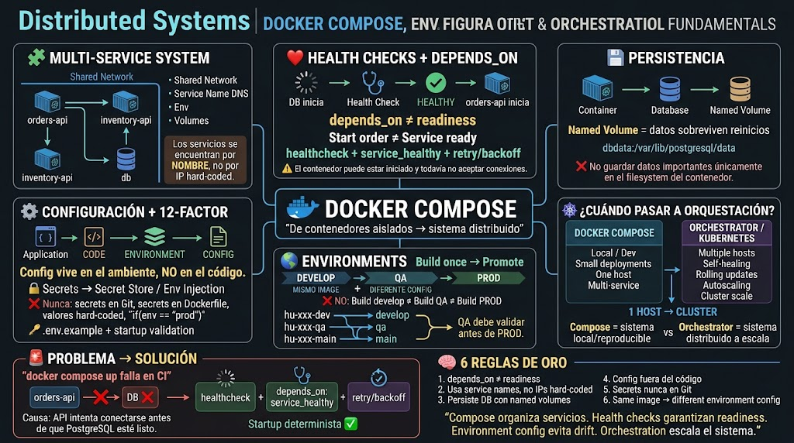

<!-- HU-STATUS TEMPLATE - do NOT remove the <!-- ... --> markers or the table headers.
     Your weekly grade is read AUTOMATICALLY from this file:
       06-week/hu-status/README.md  (inside YOUR fork). English. -->

# Weekly Status - Week 06

<!-- CONFIG-START - must match your profile repo (username/username) CONFIG -->
- FULL_NAME: Carlos Mauricio Leal Medina
- GITHUB_USER: carlosleal16
- TEAM: Barberssas
- SPRINT_GOAL: Implementar Docker Compose, configuración multi-ambiente y garantizar arranque determinista con health checks.
<!-- CONFIG-END -->

## 1. User stories worked this week
| HU ID | Title | Status (todo/doing/done) | Evidence (PR or commit URL) |
|---|---|---|---|
| HU-002-001 | Configurar Docker Compose y orquestación local con Health Checks | done |  |
| HU-002-002 | Externalizar configuración por ambientes y Secrets management | done |  |

## 2. My individual contribution
- Configuración de `docker-compose.yml` conectando `orders-api`, `inventory-api` y `db` mediante red compartida y Service Name DNS.
- Implementación del patrón de arranque determinista mediante `healthcheck` y `depends_on: service_healthy` para resolver la condición de carrera con PostgreSQL en CI.
- Persistencia de datos configurada mediante `Named Volumes` (`dbdata:/var/lib/postgresql/data`).
- Separación de configuración y código siguiendo los principios 12-Factor (archivo `.env.example`, validación al startup e inyección de secretos).

## 3. Blockers and risks
- **Riesgo solucionado:** La API intentaba conectarse a la base de datos antes de que estuviera lista para aceptar conexiones (`Start order ≠ Service ready`). Se mitigó implementando políticas de `retry/backoff` y validación de estado `HEALTHY`.

## 4. Plan for next week
- Definir el momento y estrategia de migración desde Docker Compose local hacia un orquestador a escala (Kubernetes) para entornos de Cluster/Prod.
- Configurar pipeline de CI/CD para promover la misma imagen (`Build once → Promote`) a través de los entornos de `develop`, `qa` y `main`.

## 5. Compliance self-check
- [x] Conventional Commits - `type(scope): summary`
- [x] Per-environment HU branch + PR to that environment (hu-xxx-dev -> develop, ...)
- [x] Testable acceptance criteria
- [x] Tests added/updated (unit / integration)
- [x] DDD / hexagonal boundaries respected (domain has no I/O)
- [x] No secrets; config via environment variables

## 6. Evidence links
- 

- https://github.com/carlosleal16/sistemas-distribuidos-2026-b-g2-carlos-mauricio-leal-medina.git
