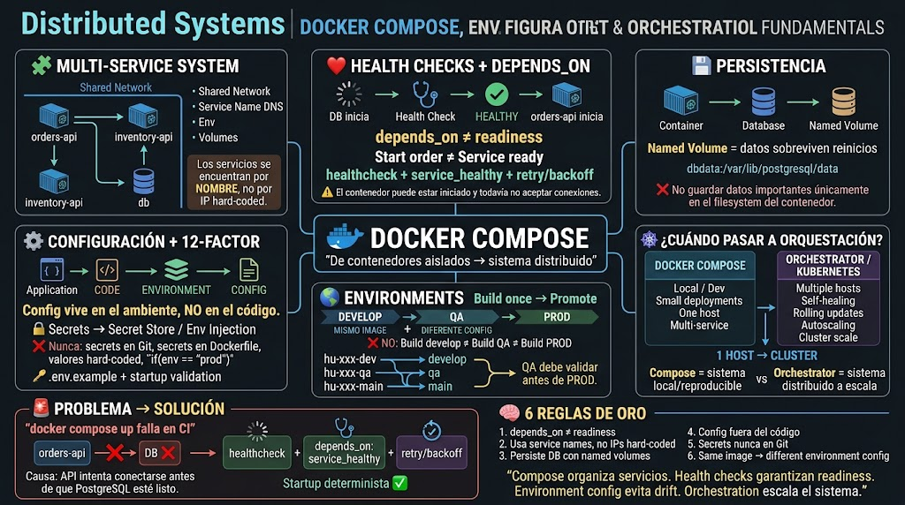

<!-- HU-STATUS TEMPLATE - do NOT remove the <!-- ... --> markers or the table headers.
     Your weekly grade is read AUTOMATICALLY from this file:
       06-week/hu-status/README.md  (inside YOUR fork). English. -->

# Weekly Status - Week 06

<!-- CONFIG-START - must match your profile repo (username/username) CONFIG -->
- FULL_NAME: Carlos Mauricio Leal Medina
- GITHUB_USER: carlosleal16
- TEAM: Barberssas
- SPRINT_GOAL: Implement Docker Compose with multi-environment configuration and guarantee a deterministic startup with health checks.
<!-- CONFIG-END -->

## 1. User stories worked this week
| HU ID | Title | Status (todo/doing/done) | Evidence (PR or commit URL) |
|---|---|---|---|
| HU-002-001 | Configure Docker Compose and local orchestration with health checks | done | Week summary commit [`a2908b7`](https://github.com/carlosleal16/sistemas-distribuidos-2026-b-g2-carlos-mauricio-leal-medina/commit/a2908b7) and the session infographic below |
| HU-002-002 | Externalize per-environment configuration and secrets management | done | Same commit and infographic |

> This week was the sessions' lab on orchestration (sessions 1 and 2). The `code-corhuila`
> organization had no code repositories yet, so there is no pull request for this week: my first
> pull request in the project is `barber-saas-docs#15`, opened on 2026-09-17 (week 07).

## 2. My individual contribution
- `docker-compose.yml` connecting `orders-api`, `inventory-api` and `db` through a shared network
  and service-name DNS.
- A deterministic startup with `healthcheck` and `depends_on: service_healthy`, which removes the
  race condition with PostgreSQL in CI.
- Data persistence with a named volume (`dbdata:/var/lib/postgresql/data`).
- Configuration separated from code following the 12-Factor principles: an `.env.example`
  file, validation at startup and injected secrets.
- Week summary and infographic committed to this repository on 2026-09-13
  ([`a2908b7`](https://github.com/carlosleal16/sistemas-distribuidos-2026-b-g2-carlos-mauricio-leal-medina/commit/a2908b7)).

## 3. Blockers and risks
- **Solved risk:** the API tried to connect to the database before it accepted connections
  (start order ≠ service ready). It was mitigated with retry/backoff and by waiting for the
  `HEALTHY` state.
- The product code repositories did not exist yet, so the week's work could not be delivered
  through pull requests.

## 4. Plan for next week
- Decide when and how to move from local Docker Compose to an orchestrator at scale
  (Kubernetes) for cluster/production environments.
- Configure a CI/CD pipeline that promotes the same image (build once → promote) through
  `develop`, `qa` and `main`.

## 5. Compliance self-check
- [x] Conventional Commits - `type(scope): summary`
- [ ] Per-environment HU branch + PR to that environment (hu-xxx-dev -> develop, ...): N/A this week, since the organization had no code repositories yet
- [x] Testable acceptance criteria: the service is ready only when its health check is `HEALTHY`
- [ ] Tests added/updated (unit / integration): N/A, lab configuration only
- [ ] DDD / hexagonal boundaries respected (domain has no I/O): N/A, no domain code this week
- [x] No secrets; config via environment variables

## 6. Evidence links
- [`a2908b7`](https://github.com/carlosleal16/sistemas-distribuidos-2026-b-g2-carlos-mauricio-leal-medina/commit/a2908b7): week 06 status summary on Docker Compose and orchestration
- 
- https://github.com/carlosleal16/sistemas-distribuidos-2026-b-g2-carlos-mauricio-leal-medina
