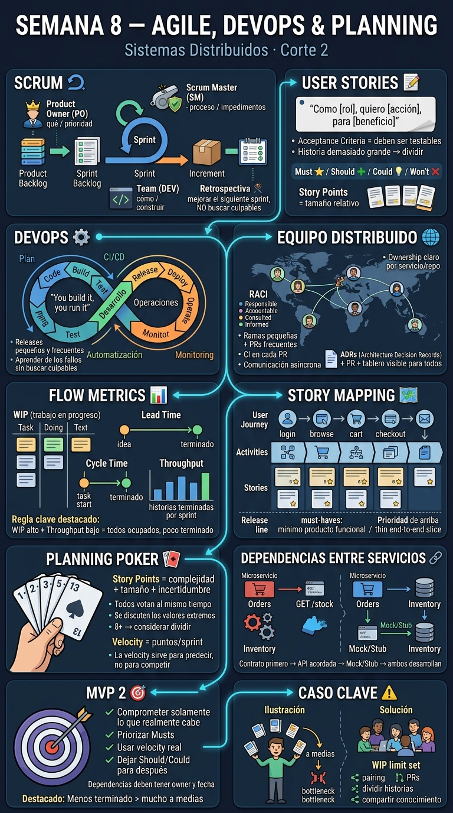

<!-- HU-STATUS TEMPLATE - do NOT remove the <!-- ... --> markers or the table headers.
     Your weekly grade is read AUTOMATICALLY from this file:
       08-week/hu-status/README.md  (inside YOUR fork). English. -->

# Weekly Status - Week 08

<!-- CONFIG-START - must match your profile repo (username/username) CONFIG -->
- FULL_NAME: Carlos Mauricio Leal Medina
- GITHUB_USER: carlosleal16
- TEAM: Barberssas
- SPRINT_GOAL: Turn the sprint mechanics already defined in `00-governance/agile-conventions.md` (WIP limit, PR-per-change, async daily sync, throughput) into practice, and turn the Phase 2/3 scope in `01-context/scope.md` into a story-mapped, dependency-sequenced MVP 2 backlog ready for Planning Poker estimation.
<!-- CONFIG-END -->

## 1. User stories worked this week
| HU ID | Title | Status (todo/doing/done) | Evidence (PR or commit URL) |
|---|---|---|---|
| HU-PROC-001 | As the team, we want a WIP-limited board with a PR for every change and an async daily sync, so that we can run the sprint like a real team instead of ad hoc work | doing | No commit yet this week in DOCS/WEEKLY/CODE (`git log --since=2026-09-17` is empty on all three repos as of 2026-09-21) — see Blockers |
| HU-PROC-002 | As the team, we want a story map of the product and a sequenced cross-service dependency map, so that the MVP 2 backlog can be refined and estimated with Planning Poker | doing | Draft produced this week in Section 2 below, built from `01-context/scope.md` (Out of Scope §Future) and `09-microservices/service-catalog.md` (Inter-module communication) — not yet committed to DOCS, pending review |

> No HU from `04-requirements/user-stories.md` (HU-AUTH-001 … HU-TENANT-001, MVP 1) was worked
> this week — that backlog is already 9/10 Done per `03-product/product-backlog.md`. This
> week's two sessions are process work (running the sprint discipline; planning MVP 2), which
> is why the rows above are process HUs instead of product HUs.

## 2. My individual contribution
- **Session 1 — running the sprint:** reviewed the sprint mechanics already agreed in
  `00-governance/agile-conventions.md` (board columns Backlog → Ready → In Progress → In
  Review → Done; async daily sync format; PR-per-change via `00-governance/branching-policy.md`)
  and identified what is still missing to actually run them: no WIP limit number is set yet,
  and the GitHub Projects board referenced there is still "Pending — no board has been
  created." Proposing a **WIP limit of 1** for now, tied to the documented constraint that
  effective hands-on capacity is 1 developer most weeks (`agile-conventions.md` → Sprint
  structure).
- **Session 2 — MVP 2 planning:** drafted a story map and a cross-service dependency map for
  MVP 2, sourced only from already-documented backlog data (no invented estimates):

  **Story map backbone** (user journey, left to right) — each column is an MVP 1 epic already
  Done, used as the spine the MVP 2 release line hangs off:
  `Identity & Access (EP-001)` → `Barbershop & Staff (EP-002)` → `Appointment Booking (EP-003)`
  → `Loyalty (EP-004)` → `Finance & Inventory (EP-005/006)` → `Notifications (EP-007)` →
  `Platform Admin (EP-008)`.

  **MVP 2 candidate stories** (release line under that spine), pulled from `01-context/scope.md`
  — status `todo`, points intentionally left `TBD`, no Planning Poker session has happened yet:

  | Candidate story | Column | Source | Points |
  |---|---|---|---|
  | Complete walk-in client tracking | Appointment Booking | `scope.md` MVP feature #13 (in progress) | TBD |
  | Automate trial-expiration handling | Barbershop & Staff | `scope.md` MVP feature #14 (in progress) | TBD |
  | Migrate dev DB from MySQL to PostgreSQL | cross-cutting | `scope.md` External dependency, Phase 2 | TBD |
  | Deploy backend to Railway | cross-cutting | `scope.md` External dependency, Phase 2 | TBD |
  | In-app payment processing (PSE/Nequi/Stripe) | Finance & Inventory | `scope.md` Out of scope #1, Phase 3 | TBD |
  | Client-facing web app (QR booking) | cross-cutting | `scope.md` Out of scope #2, Phase 3 | TBD |
  | Advanced analytics / PDF exports | Platform Admin | `scope.md` Out of scope #3, Phase 3 | TBD |
  | Redis-based token revocation / rate limiting | Identity & Access | `scope.md` External dependency, pre-production | TBD |

  **Cross-service dependencies** (contract-first + mocks candidates), from
  `service-catalog.md` → Inter-module communication — today these are in-process calls inside
  the modular monolith, which is exactly why they are the right candidates to define as
  contracts now, before any extraction:

  | From | To | Today | Once extracted (contract-first target) |
  |---|---|---|---|
  | `appointment` | `notification` | in-process call | HTTP POST or event publish — contract to define first, mock `notification` while `appointment` is built against it |
  | `appointment` | `loyalty` | in-process call | HTTP GET or event subscribe |
  | `loyalty` | `notification` | **planned, not yet wired** (drift noted in `02-domain/domain-map.md`) | HTTP POST or event publish — flagged as a real gap, not just a future nice-to-have |
  | `auth` | all modules | `TenantContext` (ThreadLocal) | JWT propagation via HTTP header |

## 3. Blockers and risks
- **No measured velocity yet.** `agile-conventions.md` → Team velocity table has Sprint 1/2/3
  all empty. Session 2 asks for an MVP 2 scope "tied to your velocity" — that cannot honestly
  be done until at least one WIP-limited sprint closes and throughput is measured. Committing
  to a specific MVP 2 story count this week would be inventing a number that doesn't exist.
- **No WIP limit or board exist yet in practice.** The columns are documented, but the GitHub
  Projects board is still "Pending" and no WIP limit number was ever set — this week proposes
  WIP = 1, but it needs the team's sign-off before it counts as adopted.
- **CODE (`barber-saas`) still has no application code**, only `README.md`/`CLAUDE.md` — so
  "a PR for every change" has nothing to attach to yet on the CODE side; DOCS is the only repo
  where PR discipline can be exercised today.
- **No live Planning Poker session has run.** The MVP 2 candidate table above is a proposed
  input to that session, not its output — story points are `TBD` on purpose.

## 4. Plan for next week
- Get the team's sign-off on WIP = 1 (or the number they actually agree on) and create the
  GitHub Projects board referenced in `agile-conventions.md`.
- Run the actual async Planning Poker vote on the MVP 2 candidate list above and record the
  results in `00-governance/agile-conventions.md` (velocity table) and
  `04-requirements/user-stories.md` (new HUs, Story Points, Target Sprint columns).
- Once Sprint 1 closes under the WIP limit, record its throughput and use that — not a guess —
  to commit the first realistic MVP 2 scope.
- Open the first PR against DOCS or CODE under the new discipline, as a working example of
  the "PR for every change" rule in practice.

## 5. Compliance self-check
- [ ] Conventional Commits - `type(scope): summary`
- [ ] Per-environment HU branch + PR to that environment (hu-xxx-dev -> develop, ...)
- [ ] Testable acceptance criteria
- [ ] Tests added/updated (unit / integration)
- [ ] DDD / hexagonal boundaries respected (domain has no I/O)
- [ ] No secrets; config via environment variables

> All unchecked, honestly: no code or docs were committed this week as of this delivery — the
> work above (story map, dependency map, WIP proposal) exists only in this file, pending
> review and the team's explicit authorization to commit/push. Nothing here touches code, so
> tests / DDD boundaries / secrets checks don't apply yet either.

## 6. Evidence links
- `00-governance/agile-conventions.md` (DOCS) — sprint structure, ceremonies, estimation scale, empty velocity table
- `00-governance/branching-policy.md` (DOCS) — PR-per-change / no-direct-commit policy
- `03-product/product-backlog.md` (DOCS) — MVP 1 epics (EP-001…EP-009), source of the story map backbone
- `04-requirements/user-stories.md` (DOCS) — MVP 1 HUs (HU-AUTH-001…HU-TENANT-001), Story Points/Target Sprint left blank pending real estimation
- `01-context/scope.md` (DOCS) — source of every MVP 2 candidate story listed in Section 2
- `09-microservices/service-catalog.md` (DOCS) — Inter-module communication table, source of the dependency map
- `08-week/hu-status/08-week-session1-session2.jpg` (this repo) — session summary infographic
- 
