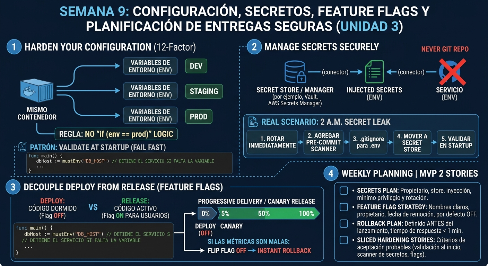

<!-- HU-STATUS TEMPLATE - do NOT remove the <!-- ... --> markers or the table headers.
     Your weekly grade is read AUTOMATICALLY from this file:
       09-week/hu-status/README.md  (inside YOUR fork). English. -->

# Weekly Status - Week 09

<!-- CONFIG-START - must match your profile repo (username/username) CONFIG -->
- FULL_NAME: Carlos Mauricio Leal Medina
- GITHUB_USER: carlosleal16
- TEAM: Barberssas
- SPRINT_GOAL: Close the `07-api` part of `code-corhuila/barber-saas-docs#29` by aligning the shared API contract with Norma 2026-B (error codes, `traceId`, idempotency and correlation headers, pagination, money), and plan config hardening and a safe rollout for MVP 2 (`.env.example`, fail-fast startup validation, injected secrets, pre-commit secret scan, feature flags, canary + rollback).
<!-- CONFIG-END -->

## 1. User stories worked this week
| HU ID | Title | Status (todo/doing/done) | Evidence (PR or commit URL) |
|---|---|---|---|
| HU-GOV-029 | As the team, we want `07-api` aligned with the common contract of Norma 2026-B (numerals 5.3.5–5.3.9, 5.6), so that every `-api` and the `-workflow` share one error, header, pagination and money format from their first endpoint | done | [PR #33](https://github.com/code-corhuila/barber-saas-docs/pull/33), merged to `main` at [`cf4d983`](https://github.com/code-corhuila/barber-saas-docs/commit/cf4d983) on 2026-09-28, approved by `ariel5253`. Refs [`barber-saas-docs#29`](https://github.com/code-corhuila/barber-saas-docs/issues/29) |
| HU-GOV-029 (follow-up) | As the team, we want the shared contract and the service template in English, with every non-compliant error code mapped to its replacement, so that new service contracts start compliant and in the project language (ADR-001) | done | [PR #34](https://github.com/code-corhuila/barber-saas-docs/pull/34), merged to `main` at [`aeaad91`](https://github.com/code-corhuila/barber-saas-docs/commit/aeaad91) on 2026-09-28, approved by `ariel5253`. Applies the automated review of #33 |
| HU-GOV-RED | As the team, we want the governance, architecture and data items the teacher's tracker marked red closed with project-specific content (ADR register, UUID decision, overview, deployment, data model, DoD/DoR, documentation rules), so that every section agrees with ADR-004 and with the real state of the 29 repositories | done | [PR #49](https://github.com/code-corhuila/barber-saas-docs/pull/49), merged to `main` at [`ae43f2e`](https://github.com/code-corhuila/barber-saas-docs/commit/ae43f2e) on 2026-09-30, approved by `ariel5253`. Follow-up applying its review: [PR #50](https://github.com/code-corhuila/barber-saas-docs/pull/50), merged at [`a95c4da`](https://github.com/code-corhuila/barber-saas-docs/commit/a95c4da). Refs [`#29`](https://github.com/code-corhuila/barber-saas-docs/issues/29), [`#31`](https://github.com/code-corhuila/barber-saas-docs/issues/31), [`#25`](https://github.com/code-corhuila/barber-saas-docs/issues/25) |
| HU-SEC-001 | As a super-admin operating the SaaS, I want every service to ship a `.env.example`, validate its required env vars at startup (fail fast), read secrets injected from a store (never from git) and block commits with secrets via a pre-commit scan, so that a missing or leaked secret is caught before it reaches any environment | todo | Pending: no service code exists yet (see Blockers) |
| HU-SEC-002 | As an admin (barbershop owner), I want a new MVP 2 capability to ship behind a feature flag (default OFF), so that it can be deployed dark and then released or turned off instantly without a redeploy | todo | Pending |
| HU-SEC-003 | As the team, we want a secrets plan (owner + rotation), a feature-flag policy (naming, owner, removal date) and a canary + rollback plan for one MVP 2 feature, so that the MVP 2 release is rolled out safely and reversibly | todo | Pending |

> HU-GOV-029 is issue [`barber-saas-docs#29`](https://github.com/code-corhuila/barber-saas-docs/issues/29)
> (align governance with the course norm). The `00-governance` part was done by Daniel Cerquera in
> PR #30; my two PRs cover the `07-api` part. HU-GOV-RED groups the red items of the teacher's
> tracker that were assigned to me (governance, architecture, data). HU-SEC-001…003 are this
> week's session topics (Session 1: hardening; Session 2: secure-config and rollout plan). They get
> updated as work lands.

## 2. My individual contribution
- **[PR #33](https://github.com/code-corhuila/barber-saas-docs/pull/33): shared contract aligned with Norma 2026-B**
  (branch `docs/015-api-common-contract`, 1 commit `8b48f82`, 3 files, +257 / −26):
  - `07-api/contracts/openapi/_shared.yaml` bumped to **1.1.0**. All changes are additive, so no
    existing `$ref` breaks:
    - A closed `ErrorCode` list (5.3.5). `ErrorResponse.traceId` is now **required** and equals
      `X-Correlation-Id`.
    - `PaginatedList` (`{data, meta}`), `Money` in integer minor units, and `Timestamp` as
      RFC 3339 UTC.
    - `IdempotencyKeyHeader` and `CorrelationIdHeader`, plus the response headers
      `X-Correlation-Id`, `Location` and `Retry-After`.
    - Reusable 422 (`InvalidStatusTransition`, `BusinessRuleViolation`), 429 and 503 responses.
    - `bearerAuth` documents RS256 as the target of 5.3.7.
  - `07-api/guidelines.md`: replaced the old "monolith, no api-gateway" versioning note with
    ADR-004 plus the gateway as the single entry point. Also added the common-contract table and
    aligned the status codes to the closed list (`409` → `422`).
  - `07-api/open-questions.md`: OQ-01 (429) partially closed and OQ-02 fixed by 5.3.8. Opened
    **OQ-04** (JWT signed with HS512 while the norm requires RS256, which needs an ADR) and
    **OQ-05** (service contracts still use `409`, `type: number` money, no idempotency or
    correlation headers, and servers that point at services instead of the gateway).
  - Tested: `_shared.yaml` parses as YAML, every example carries `traceId` and a code from
    `ErrorCode`, and the 27 `$ref`s from `appointment-`, `auth-` and `notification-service.yaml`
    still resolve. The diff is 283 lines, under the 400-line limit (9.2).
- **[PR #34](https://github.com/code-corhuila/barber-saas-docs/pull/34): follow-up applying the automated review of #33**
  (branch `docs/016-api-english-translation`, 1 commit `c028732`, 4 files, +135 / −122):
  - `_shared.yaml` and `_template-service.yaml` translated to English (ADR-001). The template
    placeholders were renamed (`[Resource]`, `[requiredField1]`…), so new contracts start in the
    project language (review recommendation 1).
  - OQ-05 now maps each non-compliant error code in the current contracts to its 5.3.5
    replacement: `INVALID_TRANSITION` → `INVALID_STATUS_TRANSITION`;
    `SLOT_ALREADY_BOOKED` / `CANCELLATION_WINDOW_CLOSED` / `EMAIL_ALREADY_EXISTS` →
    `BUSINESS_RULE_VIOLATION`; `INVALID_CREDENTIALS` → `UNAUTHORIZED` (recommendation 4).
  - `guidelines.md`: ADR-004 is now a real link to its record on `main` (recommendation 3).
    Recommendation 2 (issue scope) was answered in the PR: `00-governance` was covered by #30.
  - Tested: no Spanish text left in the 4 files, all `$ref`s still resolve, and the diff is
    257 lines (under 400).
- **[PR #49](https://github.com/code-corhuila/barber-saas-docs/pull/49): closing the tracker's red items in governance, architecture and data**
  (branch `docs/red-items-arch-data`, 6 commits, 9 files, +229 / −61):
  - **Checked before writing.** Most of the red items had already been closed on `main` by
    teammates' PRs (#32, #36–#42), so each target file was compared against `main` first and
    only what was still missing was completed. No file was created or replaced.
  - `17c313b` — `05-architecture/decisions/README.md`: replaced the template note with the
    numbering rule, the norm 4.2.3 sections and a table mapping every decision the norm requires
    (4.2.1, 4.2.2, 5.3.5, 5.8.4) to its ADR.
  - `0e3dc0c` — ADR-010: the UUID decision already lives there (ADR-005 is taken by the
    language decision, so a new "ADR-005 UUID" would have duplicated it). Linked it to
    `_shared.yaml#/components/schemas/UUID` and to the id-porting table of `migration-strategy.md`.
  - `9b0a9eb` — `overview.md`: Platform Admin also has its `-app` repository (29 = 5 + 8 × 3).
    The debt table got a status column (AT-001…003 closed by #38/#39), plus a new **AT-008**: the
    seeded README of all 29 code repositories says "LMS Library" instead of BarberSaaS.
  - `5c49dcc` — `deployment.md`: a "Pending" section listing every artifact the deployment view
    needs (compose, scripts, env examples, observability, Dockerfiles, migration runners) and its
    repository. Checked with `git ls-files` on `develop`, `qa` and `main`: none exists yet.
  - `803f553` — `06-data/models.md`: linked the exact prototype transcription
    (`8df7fec:06-data/models.md`) and added a table with every gap it flagged and where it was
    resolved (walk-in `client_id`, `trial_ends_at`, positive amount, double booking, UUID). The
    plan-names mismatch stays open. Also dropped two notes about `priceAtBookingCents` and
    `NotificationType` that #39 had already closed.
  - `68e190b` — `00-governance`:
    - **DoD:** the real flow (gates G3–G5: HANDOFF report → `review-gate` verdict → PR under the
      review rule) and a checklist for documentation stories. CI, coverage, integration and
      smoke criteria are listed as **not enforceable yet** instead of ticked.
    - **DoR:** the story owner signs G1.
    - **documentation-rules:** languages per ADR-001 and the real section layout. A "Who today"
      column added to the owners table was reverted in #50: the team had already defined those
      roles.
    - **microservices-documentation:** the 8 domains with their contract, data model and
      docs-folder state.
  - Rebased on `main` after #44–#48 merged mid-work, with no conflicts; `07-api/contracts/` untouched.
  - Approved by `ariel5253` and squash-merged at `ae43f2e`. The review raised 4 recommendations,
    each answered in writing on the PR.
- **[PR #50](https://github.com/code-corhuila/barber-saas-docs/pull/50): applying the review of #49**
  (branch `docs/red-items-review-followup`, 5 commits, 7 files, +62 / −26; merged at `a95c4da`):
  - `bb50aa6`: the DoD cited `_ecosistema/SPEC-PLAN-PROMPT.md`, which no repository tracks. It
    now defines gates G0–G5 and the `review-gate` rubric itself, and the DoR and
    `agile-conventions.md` link to it (recommendation 1).
  - `b589997`: ADR-010's references are anchored to the commits that wrote them (`b694d35`,
    `f6321e2`) (recommendation 2).
  - `ddfd6c2`: the bot read the deployment checklist as dropped. A `diff` showed it was only
    renumbered from §10 to §11, unchanged, and the document now says so (recommendation 3).
  - `0320aff`: the eight missing `09-microservices` folders are recorded as open and deferred,
    not closed (recommendation 4).
  - `ad05c71`: the owners-per-section table restored to its original content.
  - Its own review raised 4 more recommendations. The diff figures in the description were
    corrected; the other three were answered in writing on the PR (the anchor was verified,
    the owners table keeps roles only by design).
- **Session 1/2 groundwork (security & config).** Reviewed what DOCS already has, so the
  hardening plan extends it instead of duplicating it:
  - `00-governance/security-policy.md` forbids real values in `.env` / `.env.example` and names a
    vault as the target store. It also records a **known gap**: a placeholder `JWT_SECRET`
    committed in the prototype's `application.yml`. Rotation is described only for refresh tokens,
    not for service secrets, and that is the gap the secrets plan must close.
  - `10-devops/environments.md` already has the env-var naming convention, the per-environment
    variable table and a rollback section, which the canary + rollback plan will reuse.
  - No feature-flag policy exists anywhere in DOCS yet.
  - This week's contract work links to hardening in two places. OQ-04 (HS512 → RS256, closed
    by #39) makes the JWT signing material a key pair whose private half lives only in
    identity-auth (`05-architecture/deployment.md` §6). And the new `X-Correlation-Id` /
    `traceId` is what a canary needs to compare error rates between versions before flipping a
    flag back off.

## 3. Blockers and risks
- **No application code to harden yet.** The 29 evaluated repos in `code-corhuila`
  (`barber-saas-*-{db,api,app}`, gateway, infra, front, worker, workflow) contain only their
  initial files (2 tracked files each, verified with `git ls-files` on 2026-09-30). Startup
  validation, a pre-commit scan and a real feature flag need a runnable service, so the first
  hardening PR has to land together with (or right after) the first service skeleton.
- **Open contradictions recorded in PR #49, not guessed:**
  - The seeded plan names disagree (Basico/Pro/Premium in `06-data` vs.
    Starter/Profesional/Premium in `01-context`); the team has to confirm which is current.
  - `09-microservices/service-catalog.md` still describes the monolith (AT-006).
- **AT-008: the 29 code repositories name the wrong project.** Their seeded `README.md` says
  "LMS Library" and links `library-docs`. Fixing it takes a `chore/` PR in each repository.
- *Update:* OQ-04 (HS512 → RS256) and OQ-05 (service contracts not compliant), listed here
  earlier this week, were both closed by Daniel Cerquera's
  [PR #39](https://github.com/code-corhuila/barber-saas-docs/pull/39).
- **Committed placeholder secret (known gap).** `security-policy.md` documents a placeholder
  `JWT_SECRET` in the prototype. It is not a real credential, but new services must not copy
  that pattern. Committing a real secret is a **grave fault (norm 13)**, so the pre-commit
  scanner must be in place before any service gets real configuration.

## 4. Plan for next week
- ~~Get PR #49 approved and merged, and apply its review~~: done this week (#49 and #50 merged).
- Write the secrets plan of HU-SEC-003 on top of `deployment.md` §6. Its first entry is the
  RS256 key pair: private key only in identity-auth, with an owner and rotation by `kid`.
- Resolve the plan-names contradiction with the team, and propose the `chore/` fix for AT-008.
- Persistence (per the course plan), then the MVP 2 release, using the canary + rollback plan
  and the flag policy from HU-SEC-003.

## 5. Compliance self-check
- [x] Conventional Commits - `type(scope): summary`: `docs(api): align shared contract with course norm 2026-b` (#33), `docs(api): translate shared contract and service template to english` (#34), and one `docs(architecture|data|governance): …` commit per task in #49
- [ ] Per-environment HU branch + PR to that environment (hu-xxx-dev -> develop, ...): N/A for
      DOCS. Its documented branching exception is `docs/…` → `main` with no per-environment
      branches (`00-governance/git-conventions.md`, category B). All three PRs followed it.
- [x] Testable acceptance criteria: each PR lists verifiable checks in "How it was tested". For
      #33/#34: YAML parses, `traceId` + `ErrorCode` in every example, `$ref`s resolve. For #49:
      claims about the code repositories checked with `git ls-files`, contract facts checked in the
      YAML. Every diff is under 400 lines.
- [ ] Tests added/updated (unit / integration): N/A, OpenAPI contract and docs only, no application code
- [ ] DDD / hexagonal boundaries respected (domain has no I/O): N/A, same reason
- [x] No secrets; config via environment variables: contract/docs files only, "No secrets" checked in all three PRs

## 6. Evidence links
- [PR #33](https://github.com/code-corhuila/barber-saas-docs/pull/33) (DOCS, merged `cf4d983`): `_shared.yaml` 1.1.0, `guidelines.md`, `open-questions.md` (OQ-04, OQ-05)
- [PR #34](https://github.com/code-corhuila/barber-saas-docs/pull/34) (DOCS, merged `aeaad91`): English translation of `_shared.yaml` and `_template-service.yaml`, OQ-05 error-code mapping
- [PR #49](https://github.com/code-corhuila/barber-saas-docs/pull/49) (DOCS, open, awaiting approval): tracker red items in governance, architecture and data. 6 commits: `17c313b`, `0e3dc0c`, `9b0a9eb`, `5c49dcc`, `803f553`, `68e190b`
- [Issue #29](https://github.com/code-corhuila/barber-saas-docs/issues/29) (DOCS): align governance with the course norm and framework pillars (origin of HU-GOV-029 and HU-GOV-RED)
- [Issue #31](https://github.com/code-corhuila/barber-saas-docs/issues/31) (DOCS): ADRs required by the course norm
- [Issue #25](https://github.com/code-corhuila/barber-saas-docs/issues/25) (DOCS): HU-APPT-003 walk-in appointments (data side: nullable `client_id`)
- `00-governance/security-policy.md` (DOCS): secret management rules, known `JWT_SECRET` gap, grave-fault note
- `10-devops/environments.md` (DOCS): env-var naming, per-environment variables, deploy strategies and rollback
- `09-week/hu-status/session1_session2.jpg` (this repo): session summary infographic
- 
