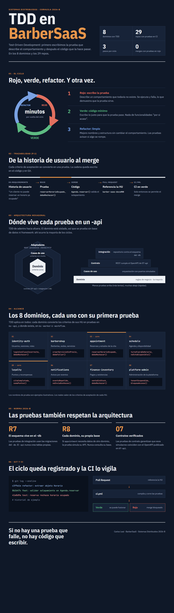

<!-- HU-STATUS TEMPLATE - do NOT remove the <!-- ... --> markers or the table headers.
     Your weekly grade is read AUTOMATICALLY from this file:
       09-week/hu-status/README.md  (inside YOUR fork). English. -->

# Weekly Status - Week 09

<!-- CONFIG-START - must match your profile repo (username/username) CONFIG -->
- FULL_NAME: Carlos Mauricio Leal Medina
- GITHUB_USER: carlosleal16
- TEAM: Barberssas
- SPRINT_GOAL: Close the `07-api` part of `code-corhuila/barber-saas-docs#29` (shared contract aligned with Norma 2026-B) and the tracker's red items, then migrate my two domains of the prototype to the Annex J architecture: `barbershop` and `schedule` each with its `-db` (Liquibase schema + roles), hexagonal `-api` (Java 21, Spring Boot 3.5, tests first) and Ionic React `-app`, routed by the gateway and included in the infra, all merged to `develop` with green CI.
<!-- CONFIG-END -->

## 1. User stories worked this week
| HU ID | Title | Status (todo/doing/done) | Evidence (PR or commit URL) |
|---|---|---|---|
| HU-GOV-029 | As the team, we want `07-api` aligned with the common contract of Norma 2026-B (numerals 5.3.5–5.3.9, 5.6), so that every `-api` and the `-workflow` share one error, header, pagination and money format from their first endpoint | done | [PR #33](https://github.com/code-corhuila/barber-saas-docs/pull/33), merged to `main` at [`cf4d983`](https://github.com/code-corhuila/barber-saas-docs/commit/cf4d983) on 2026-09-28, approved by `ariel5253`. Refs [`barber-saas-docs#29`](https://github.com/code-corhuila/barber-saas-docs/issues/29) |
| HU-GOV-029 (follow-up) | As the team, we want the shared contract and the service template in English, with every non-compliant error code mapped to its replacement, so that new service contracts start compliant and in the project language (ADR-001) | done | [PR #34](https://github.com/code-corhuila/barber-saas-docs/pull/34), merged to `main` at [`aeaad91`](https://github.com/code-corhuila/barber-saas-docs/commit/aeaad91) on 2026-09-28, approved by `ariel5253`. Applies the automated review of #33 |
| HU-GOV-RED | As the team, we want the governance, architecture and data items the teacher's tracker marked red closed with project-specific content (ADR register, UUID decision, overview, deployment, data model, DoD/DoR, documentation rules), so that every section agrees with ADR-004 and with the real state of the 29 repositories | done | [PR #49](https://github.com/code-corhuila/barber-saas-docs/pull/49), merged to `main` at [`ae43f2e`](https://github.com/code-corhuila/barber-saas-docs/commit/ae43f2e) on 2026-09-30, approved by `ariel5253`. Follow-up applying its review: [PR #50](https://github.com/code-corhuila/barber-saas-docs/pull/50), merged at [`a95c4da`](https://github.com/code-corhuila/barber-saas-docs/commit/a95c4da). Refs [`#29`](https://github.com/code-corhuila/barber-saas-docs/issues/29), [`#31`](https://github.com/code-corhuila/barber-saas-docs/issues/31), [`#25`](https://github.com/code-corhuila/barber-saas-docs/issues/25) |
| HU-TENANT-001 / HU-APPT-001 (barbershop domain) | As a client, I want to search barbershops and see their services and barbers, and as an admin (barbershop owner) I want to manage my services, barbers and specialties, with every read and write scoped to the barbershop in my token, so that the booking flow (HU-APPT-001) has a real catalog and tenants never see each other's data (HU-TENANT-001) | done (in `develop`) | `barbershop-db` [#2](https://github.com/code-corhuila/barber-saas-barbershop-db/pull/2) [#3](https://github.com/code-corhuila/barber-saas-barbershop-db/pull/3) [#4](https://github.com/code-corhuila/barber-saas-barbershop-db/pull/4); `barbershop-api` [#2](https://github.com/code-corhuila/barber-saas-barbershop-api/pull/2)–[#10](https://github.com/code-corhuila/barber-saas-barbershop-api/pull/10), [#12](https://github.com/code-corhuila/barber-saas-barbershop-api/pull/12)–[#15](https://github.com/code-corhuila/barber-saas-barbershop-api/pull/15); `barbershop-app` [#2](https://github.com/code-corhuila/barber-saas-barbershop-app/pull/2)–[#8](https://github.com/code-corhuila/barber-saas-barbershop-app/pull/8). All merged 2026-10-02 with green CI. Refs [`barber-saas-docs#4`](https://github.com/code-corhuila/barber-saas-docs/issues/4), [`#13`](https://github.com/code-corhuila/barber-saas-docs/issues/13) |
| HU-TENANT-001 / HU-APPT-001 (schedule domain) | As a barber, I want to set my weekly schedule (split shifts), days off and special hours, and as an admin I want to do it for any barber of my barbershop, so that a client only sees real free slots (availability) before booking | done (in `develop`) | `schedule-db` [#2](https://github.com/code-corhuila/barber-saas-schedule-db/pull/2) [#3](https://github.com/code-corhuila/barber-saas-schedule-db/pull/3) [#4](https://github.com/code-corhuila/barber-saas-schedule-db/pull/4); `schedule-api` [#2](https://github.com/code-corhuila/barber-saas-schedule-api/pull/2)–[#14](https://github.com/code-corhuila/barber-saas-schedule-api/pull/14); `schedule-app` [#2](https://github.com/code-corhuila/barber-saas-schedule-app/pull/2)–[#6](https://github.com/code-corhuila/barber-saas-schedule-app/pull/6). All merged 2026-10-02 with green CI. Refs [`barber-saas-docs#4`](https://github.com/code-corhuila/barber-saas-docs/issues/4), [`#13`](https://github.com/code-corhuila/barber-saas-docs/issues/13) |
| HU-APPT-001 (shared points) | As the team, we want the barbershop and schedule domains reachable through the single gateway and started with the rest of the platform, so that the shell and `appointment-api` call them like any other domain | done (in `develop`) | `api-gateway` [#5](https://github.com/code-corhuila/barber-saas-api-gateway/pull/5) (own route file); `infra` [#6](https://github.com/code-corhuila/barber-saas-infra/pull/6), [#7](https://github.com/code-corhuila/barber-saas-infra/pull/7) (one include line each) |
| HU-SEC-001 | As a super-admin operating the SaaS, I want every service to ship a `.env.example`, validate its required env vars at startup (fail fast), read secrets injected from a store (never from git) and block commits with secrets via a pre-commit scan, so that a missing or leaked secret is caught before it reaches any environment | doing | Partly done in my 4 runnable repos: `.env.example` with names and placeholders only ([`barbershop-api` `dd498b9`](https://github.com/code-corhuila/barber-saas-barbershop-api/commit/dd498b9)), `.gitignore` excluding `.env` and `*.pem`, every secret read from the environment, and only the RS256 **public** key in the services. Missing: fail-fast validation (an empty `DATABASE_URL` falls back to in-memory repositories on purpose) and the pre-commit secret scan |
| HU-SEC-002 | As an admin (barbershop owner), I want a new MVP 2 capability to ship behind a feature flag (default OFF), so that it can be deployed dark and then released or turned off instantly without a redeploy | todo | Pending |
| HU-SEC-003 | As the team, we want a secrets plan (owner + rotation), a feature-flag policy (naming, owner, removal date) and a canary + rollback plan for one MVP 2 feature, so that the MVP 2 release is rolled out safely and reversibly | todo | Pending |

> HU-GOV-029 is issue [`barber-saas-docs#29`](https://github.com/code-corhuila/barber-saas-docs/issues/29)
> (align governance with the course norm). The `00-governance` part was done by Daniel Cerquera in
> PR #30; my two PRs cover the `07-api` part. HU-GOV-RED groups the red items of the teacher's
> tracker that were assigned to me (governance, architecture, data). The three migration rows are my part of the
> team's migration plan (`15-project-control/migration-work-split.md`, steps 2, 4 and 6: I own
> `barbershop-*` and `schedule-*`). Their PRs reference HU-APPT-001 (#4, the booking flow they
> unblock) and HU-TENANT-001 (#13, tenant isolation). HU-SEC-001…003 are this
> week's session topics (Session 1: hardening; Session 2: secure-config and rollout plan). They get
> updated as work lands.

## 2. My individual contribution
- **[PR #33](https://github.com/code-corhuila/barber-saas-docs/pull/33): shared contract aligned with Norma 2026-B**
  (branch `docs/015-api-common-contract`, 1 commit `8b48f82`, 3 files, +257 / −26):
  - `07-api/contracts/openapi/_shared.yaml` bumped to **1.1.0**. All changes are additive, so no
    existing `$ref` breaks:
    - A closed `ErrorCode` list (5.3.5). `ErrorResponse.traceId` is now **required** and equals
      `X-Correlation-Id`.
    - `PaginatedList` (`{data, meta}`), `Money` in integer minor units, and `Timestamp` as
      RFC 3339 UTC.
    - `IdempotencyKeyHeader` and `CorrelationIdHeader`, plus the response headers
      `X-Correlation-Id`, `Location` and `Retry-After`.
    - Reusable 422 (`InvalidStatusTransition`, `BusinessRuleViolation`), 429 and 503 responses.
    - `bearerAuth` documents RS256 as the target of 5.3.7.
  - `07-api/guidelines.md`: replaced the old "monolith, no api-gateway" versioning note with
    ADR-004 plus the gateway as the single entry point. Also added the common-contract table and
    aligned the status codes to the closed list (`409` → `422`).
  - `07-api/open-questions.md`: OQ-01 (429) partially closed and OQ-02 fixed by 5.3.8. Opened
    **OQ-04** (JWT signed with HS512 while the norm requires RS256, which needs an ADR) and
    **OQ-05** (service contracts still use `409`, `type: number` money, no idempotency or
    correlation headers, and servers that point at services instead of the gateway).
  - Tested: `_shared.yaml` parses as YAML, every example carries `traceId` and a code from
    `ErrorCode`, and the 27 `$ref`s from `appointment-`, `auth-` and `notification-service.yaml`
    still resolve. The diff is 283 lines, under the 400-line limit (9.2).
- **[PR #34](https://github.com/code-corhuila/barber-saas-docs/pull/34): follow-up applying the automated review of #33**
  (branch `docs/016-api-english-translation`, 1 commit `c028732`, 4 files, +135 / −122):
  - `_shared.yaml` and `_template-service.yaml` translated to English (ADR-001). The template
    placeholders were renamed (`[Resource]`, `[requiredField1]`…), so new contracts start in the
    project language (review recommendation 1).
  - OQ-05 now maps each non-compliant error code in the current contracts to its 5.3.5
    replacement: `INVALID_TRANSITION` → `INVALID_STATUS_TRANSITION`;
    `SLOT_ALREADY_BOOKED` / `CANCELLATION_WINDOW_CLOSED` / `EMAIL_ALREADY_EXISTS` →
    `BUSINESS_RULE_VIOLATION`; `INVALID_CREDENTIALS` → `UNAUTHORIZED` (recommendation 4).
  - `guidelines.md`: ADR-004 is now a real link to its record on `main` (recommendation 3).
    Recommendation 2 (issue scope) was answered in the PR: `00-governance` was covered by #30.
  - Tested: no Spanish text left in the 4 files, all `$ref`s still resolve, and the diff is
    257 lines (under 400).
- **[PR #49](https://github.com/code-corhuila/barber-saas-docs/pull/49): closing the tracker's red items in governance, architecture and data**
  (branch `docs/red-items-arch-data`, 6 commits, 9 files, +229 / −61):
  - **Checked before writing.** Most of the red items had already been closed on `main` by
    teammates' PRs (#32, #36–#42), so each target file was compared against `main` first and
    only what was still missing was completed. No file was created or replaced.
  - `17c313b` — `05-architecture/decisions/README.md`: replaced the template note with the
    numbering rule, the norm 4.2.3 sections and a table mapping every decision the norm requires
    (4.2.1, 4.2.2, 5.3.5, 5.8.4) to its ADR.
  - `0e3dc0c` — ADR-010: the UUID decision already lives there (ADR-005 is taken by the
    language decision, so a new "ADR-005 UUID" would have duplicated it). Linked it to
    `_shared.yaml#/components/schemas/UUID` and to the id-porting table of `migration-strategy.md`.
  - `9b0a9eb` — `overview.md`: Platform Admin also has its `-app` repository (29 = 5 + 8 × 3).
    The debt table got a status column (AT-001…003 closed by #38/#39), plus a new **AT-008**: the
    seeded README of all 29 code repositories says "LMS Library" instead of BarberSaaS.
  - `5c49dcc` — `deployment.md`: a "Pending" section listing every artifact the deployment view
    needs (compose, scripts, env examples, observability, Dockerfiles, migration runners) and its
    repository. Checked with `git ls-files` on `develop`, `qa` and `main`: none exists yet.
  - `803f553` — `06-data/models.md`: linked the exact prototype transcription
    (`8df7fec:06-data/models.md`) and added a table with every gap it flagged and where it was
    resolved (walk-in `client_id`, `trial_ends_at`, positive amount, double booking, UUID). The
    plan-names mismatch stays open. Also dropped two notes about `priceAtBookingCents` and
    `NotificationType` that #39 had already closed.
  - `68e190b` — `00-governance`:
    - **DoD:** the real flow (gates G3–G5: HANDOFF report → `review-gate` verdict → PR under the
      review rule) and a checklist for documentation stories. CI, coverage, integration and
      smoke criteria are listed as **not enforceable yet** instead of ticked.
    - **DoR:** the story owner signs G1.
    - **documentation-rules:** languages per ADR-001 and the real section layout. A "Who today"
      column added to the owners table was reverted in #50: the team had already defined those
      roles.
    - **microservices-documentation:** the 8 domains with their contract, data model and
      docs-folder state.
  - Rebased on `main` after #44–#48 merged mid-work, with no conflicts; `07-api/contracts/` untouched.
  - Approved by `ariel5253` and squash-merged at `ae43f2e`. The review raised 4 recommendations,
    each answered in writing on the PR.
- **[PR #50](https://github.com/code-corhuila/barber-saas-docs/pull/50): applying the review of #49**
  (branch `docs/red-items-review-followup`, 5 commits, 7 files, +62 / −26; merged at `a95c4da`):
  - `bb50aa6`: the DoD cited `_ecosistema/SPEC-PLAN-PROMPT.md`, which no repository tracks. It
    now defines gates G0–G5 and the `review-gate` rubric itself, and the DoR and
    `agile-conventions.md` link to it (recommendation 1).
  - `b589997`: ADR-010's references are anchored to the commits that wrote them (`b694d35`,
    `f6321e2`) (recommendation 2).
  - `ddfd6c2`: the bot read the deployment checklist as dropped. A `diff` showed it was only
    renumbered from §10 to §11, unchanged, and the document now says so (recommendation 3).
  - `0320aff`: the eight missing `09-microservices` folders are recorded as open and deferred,
    not closed (recommendation 4).
  - `ad05c71`: the owners-per-section table restored to its original content.
  - Its own review raised 4 more recommendations. The diff figures in the description were
    corrected; the other three were answered in writing on the PR (the anchor was verified,
    the owners table keeps roles only by design).
- **Migration of my two domains to the Annex J architecture (8 code repositories, 54 merged PRs).**
  Following the team's work split (`15-project-control/migration-work-split.md`, PR #66 in DOCS),
  I own `barbershop-{db,api,app}` and `schedule-{db,api,app}`. The prototype
  (`code-corhuila/barber-saas`) was the base: its rules, flows, types and dark/gold design were
  kept, and the structure changed (one hexagon per service, one schema per domain, RS256).
  Every PR went `feat/…` → `develop`, merged with `--merge` only after CI was green, with one
  commit per logical step and `Refs: code-corhuila/barber-saas-docs#NN`.
  - **`-db` repos (Liquibase, 3 PRs each).** `barbershop-db` [#2–#4](https://github.com/code-corhuila/barber-saas-barbershop-db/pulls?q=is%3Apr+is%3Amerged)
    and `schedule-db` [#2–#4](https://github.com/code-corhuila/barber-saas-schedule-db/pulls?q=is%3Apr+is%3Amerged):
    - The template's DDL/DML/DCL/TCL layout with a master changelog, and only the
      `<domain>-db-migrate` runner in `deploy/`, using its own control tables
      (`databasechangelog_<domain>`, `databasechangeloglock_<domain>`), with no container or volume
      of its own (ADR-011, one PostgreSQL instance in `barber-saas-infra`).
    - Schemas `barbershop` (barbershop, service, barber_profile, barber_specialty, idempotency_key)
      and `schedule` (barber_schedule, schedule_exception, idempotency_key), with `CHECK`
      constraints taken from the contracts (e.g. `duration_minutes >= 5`, `price_cents >= 0`,
      `end_time > start_time`, one exception per barber and date) and indexes per query.
    - **No foreign keys across domains**: `schedule` keeps `barber_profile_id` as a plain UUID and
      documents why (`6270796`). Roles `<domain>_reader` / `<domain>_writer` and
      `GRANT <domain>_writer TO <domain>_app`; rollback scripts in `05_rollbacks/`.
    - `db-ci.yml` rebuilds the schema from an empty database on every PR (`469a771`).
  - **`-api` repos (Java 21, Spring Boot 3.5, 3 Maven modules).** `barbershop-api` (13 merged PRs,
    48 main + 14 test classes) and `schedule-api` (13 merged PRs, 50 main + 15 test classes):
    - `-core` has no Spring dependency: aggregates and invariants (barbershop trial rule, service,
      barber profile and specialty; weekly schedule with split shifts, exceptions, availability),
      the use cases and their ports. `-adapters` has HTTP and JDBC, `-app` is the composition root.
    - **Tests first (TDD)**: each feature PR starts with a `test(…): specify …` commit and then
      the `feat` commit that makes it pass (e.g. `f7adcc3` → `d39f750`, `786b4be` → `bc00247`).
      CI runs `mvn -B verify` on every PR.
    - The common contract of PR #33 implemented: the error envelope with `traceId`, `X-Correlation-Id`
      reused or created and logged as JSON (ECS) on every request, `Idempotency-Key` stored in the
      same transaction as the write, `{data, meta}` paging, strict body reading that rejects fields
      the contract does not allow, and a liveness probe without a token.
    - RS256 token verification with the public key only; the tenant comes **only** from the token
      (another barbershop's resource answers `404`, HU-TENANT-001).
    - The service connects as `<domain>_app`, never migrates, and has explicit pool limits,
      statement timeout, connection timeouts and graceful shutdown.
    - `schedule-api` reads the barber, durations and time zone from `barbershop-api` and the bookings
      from `appointment-api` **through their APIs** (golden rule 8), forwarding the token and the
      correlation id, with 2 s connect / 3 s request timeouts.
    - Each repo has a `Dockerfile`, `deploy/compose.yml`, `.env.example` and a README with
      "How to start it", "How to test it" and "What is missing".
  - **`-app` repos (Ionic React 8, React 19, native federation).** `barbershop-app` (7 merged PRs) and
    `schedule-app` (5 merged PRs), mounted by the `barber-saas-front` shell:
    - They call the APIs **only through the shell's `apiClient`** (golden rule 9), with types copied
      from the contracts and one idempotency key per user intent.
    - `barbershop-app`: barbershop search and detail for clients; the owner's services, barbers and
      specialties. `schedule-app`: week editor with split shifts, days off and special hours, for the
      owner (any barber) and the barber (own week).
    - Every view shows loading, error with retry, empty and data states; specs for the API calls,
      forms, routes and loader run in CI with the type check and the build.
  - **Shared points (one change each, after pull).** My own route file in `barber-saas-api-gateway`
    ([#5](https://github.com/code-corhuila/barber-saas-api-gateway/pull/5): barbershop with its
    anonymous catalog, and schedule), and the include lines in `barber-saas-infra`
    ([#6](https://github.com/code-corhuila/barber-saas-infra/pull/6),
    [#7](https://github.com/code-corhuila/barber-saas-infra/pull/7)). `CODEOWNERS` untouched.
  - Supporting housekeeping:
    - [`barbershop-api#11`](https://github.com/code-corhuila/barber-saas-barbershop-api/pull/11)
      (451 lines without tests) was closed and split into #12 and #13, to keep every PR under the
      400-line limit (9.2).
    - On 2026-09-28 I opened the `chore(governance): add claude code instructions for norma 2026-b`
      pull request in each of the 29 code repositories. All 29 were closed without merge the same
      day, so those instructions are not versioned in the code repositories: [`api-gateway#1`](https://github.com/code-corhuila/barber-saas-api-gateway/pull/1), [`appointment-api#1`](https://github.com/code-corhuila/barber-saas-appointment-api/pull/1), [`appointment-app#1`](https://github.com/code-corhuila/barber-saas-appointment-app/pull/1), [`appointment-db#1`](https://github.com/code-corhuila/barber-saas-appointment-db/pull/1), [`barbershop-api#1`](https://github.com/code-corhuila/barber-saas-barbershop-api/pull/1), [`barbershop-app#1`](https://github.com/code-corhuila/barber-saas-barbershop-app/pull/1), [`barbershop-db#1`](https://github.com/code-corhuila/barber-saas-barbershop-db/pull/1), [`finance-inventory-api#1`](https://github.com/code-corhuila/barber-saas-finance-inventory-api/pull/1), [`finance-inventory-app#1`](https://github.com/code-corhuila/barber-saas-finance-inventory-app/pull/1), [`finance-inventory-db#1`](https://github.com/code-corhuila/barber-saas-finance-inventory-db/pull/1), [`front#1`](https://github.com/code-corhuila/barber-saas-front/pull/1), [`identity-auth-api#1`](https://github.com/code-corhuila/barber-saas-identity-auth-api/pull/1), [`identity-auth-app#1`](https://github.com/code-corhuila/barber-saas-identity-auth-app/pull/1), [`identity-auth-db#1`](https://github.com/code-corhuila/barber-saas-identity-auth-db/pull/1), [`infra-postgres#1`](https://github.com/code-corhuila/barber-saas-infra-postgres/pull/1), [`loyalty-api#1`](https://github.com/code-corhuila/barber-saas-loyalty-api/pull/1), [`loyalty-app#1`](https://github.com/code-corhuila/barber-saas-loyalty-app/pull/1), [`loyalty-db#1`](https://github.com/code-corhuila/barber-saas-loyalty-db/pull/1), [`notifications-api#1`](https://github.com/code-corhuila/barber-saas-notifications-api/pull/1), [`notifications-app#1`](https://github.com/code-corhuila/barber-saas-notifications-app/pull/1), [`notifications-db#1`](https://github.com/code-corhuila/barber-saas-notifications-db/pull/1), [`platform-admin-api#1`](https://github.com/code-corhuila/barber-saas-platform-admin-api/pull/1), [`platform-admin-app#1`](https://github.com/code-corhuila/barber-saas-platform-admin-app/pull/1), [`platform-admin-db#1`](https://github.com/code-corhuila/barber-saas-platform-admin-db/pull/1), [`schedule-api#1`](https://github.com/code-corhuila/barber-saas-schedule-api/pull/1), [`schedule-app#1`](https://github.com/code-corhuila/barber-saas-schedule-app/pull/1), [`schedule-db#1`](https://github.com/code-corhuila/barber-saas-schedule-db/pull/1), [`worker#1`](https://github.com/code-corhuila/barber-saas-worker/pull/1), [`workflow#1`](https://github.com/code-corhuila/barber-saas-workflow/pull/1).
    - [`schedule-api#15`](https://github.com/code-corhuila/barber-saas-schedule-api/pull/15)
      (`feat(deploy): ask appointment-api for booked time on the platform`) was opened and merged
      on 2026-10-04 at night; it is described with HU-APPT-001 in week 10.
- **Session 2: TDD presentation.** Presented in class what TDD is and how it applies to the 8
  BarberSaaS domains:
  - A 12-slide deck with speaker notes ([`presentacion-tdd.html`](presentacion-tdd.html)) and an
    infographic ([`infografia-tdd.html`](infografia-tdd.html) /
    [`infografia-tdd.png`](infografia-tdd.png)).
  - Covers the red → green → refactor cycle and traceability HU → test → code → PR → CI (P.1).
    It also places each test type in a hexagonal `-api`: unit tests in the domain, mocks in the
    use cases, contract tests against `07-api` and integration tests against the `-db` schema.
  - Gives one example first test per domain and shows that the tests follow rules 7 and 8 of
    the norm.
  - The code samples are illustrative, since the 29 repositories have no application code yet.
- **Session 1/2 groundwork (security & config).** Reviewed what DOCS already has, so the
  hardening plan extends it instead of duplicating it:
  - `00-governance/security-policy.md` forbids real values in `.env` / `.env.example` and names a
    vault as the target store. It also records a **known gap**: a placeholder `JWT_SECRET`
    committed in the prototype's `application.yml`. Rotation is described only for refresh tokens,
    not for service secrets, and that is the gap the secrets plan must close.
  - `10-devops/environments.md` already has the env-var naming convention, the per-environment
    variable table and a rollback section, which the canary + rollback plan will reuse.
  - No feature-flag policy exists anywhere in DOCS yet.
  - This week's contract work links to hardening in two places. OQ-04 (HS512 → RS256, closed
    by #39) makes the JWT signing material a key pair whose private half lives only in
    identity-auth (`05-architecture/deployment.md` §6). And the new `X-Correlation-Id` /
    `traceId` is what a canary needs to compare error rates between versions before flipping a
    flag back off.

## 3. Blockers and risks
- **Everything is in Dev only.** My 54 PRs are merged to `develop`; `qa` and `main` of the 8
  repos still point at the seed commit. Promoting them needs `qa/…` branches re-applied with
  `git cherry-pick -x` (golden rules 3–4), never a merge between permanent branches.
- **Booking is not end to end yet.** HU-APPT-001 needs `appointment-api` (Juan Pablo, step 5 of the
  work split). Until it joins the platform, `APPOINTMENT_API_URL` is empty and `schedule-api`
  availability does not subtract booked appointments (it warns at startup).
- **Open contract questions that block parts of my services** (written in each README under
  "What is missing", not guessed):
  - **OQ-07**: a `CLIENT` token carries no barbershop, so tenant-scoped reads and availability
    answer `403` to clients (they use the public catalog for now).
  - **OQ-09**: with a client token `listAppointments` returns only that client's bookings; the
    availability needs a service token or an internal operation in `appointment-service.yaml`.
  - **OQ-10 / OQ-12**: creating a barbershop belongs to platform-admin + workflow (onboarding)
    through a service-to-service interface that is not contracted yet.
  - `auth-service.yaml` has no "read a user" operation, so a new barber profile's `userId` is not
    yet verified to be a `BARBER` of the same barbershop.
- **One PR over the size limit.** [`barbershop-api#3`](https://github.com/code-corhuila/barber-saas-barbershop-api/pull/3) has 416 changed
  lines without tests, above the 400 of 9.2. The rest stay under it (largest without tests: #8 with
  358). The two `chore(app)` PRs show +4246 because of `package-lock.json`; without it they are 315.
- **Open contradictions recorded in PR #49, not guessed:**
  - The seeded plan names disagree (Basico/Pro/Premium in `06-data` vs.
    Starter/Profesional/Premium in `01-context`); the team has to confirm which is current.
  - `09-microservices/service-catalog.md` still describes the monolith (AT-006).
- **AT-008: the code repositories name the wrong project.** Their seeded `README.md` says
  "LMS Library". In my 8 repos the teacher's text is not touched; my own section goes below it.
- *Update:* OQ-04 (HS512 → RS256) and OQ-05 (service contracts not compliant), listed here
  earlier this week, were both closed by Daniel Cerquera's
  [PR #39](https://github.com/code-corhuila/barber-saas-docs/pull/39); my services already verify
  RS256.
- **Secrets.** No secret is committed in my repos (`.env` and `*.pem` ignored, `.env.example` with
  empty values). There is still no pre-commit scanner; committing a real secret is a **grave fault
  (norm 13)**, so it is the first item of HU-SEC-001 for next week.

## 4. Plan for next week
- ~~Get PR #49 approved and merged, and apply its review~~: done (#49 and #50 merged).
- ~~Migrate `barbershop` and `schedule` (db, api, app), gateway routes and infra include~~: done in
  `develop` (54 PRs).
- Promote my 8 repos from `develop` to `qa` with `qa/…` branches and `git cherry-pick -x`, once the
  team runs the platform end to end with `appointment-api`.
- Start my second block of the work split: the `notifications` domain (`notifications-db` on
  MongoDB, `notifications-api` in Python 3.12 + FastAPI per ADR-012, `notifications-app` in Ionic
  Angular), with the tests first again.
- Finish HU-SEC-001 in my services: fail-fast validation of required variables outside the
  in-memory mode and a pre-commit secret scan. Then HU-SEC-003 (secrets plan on top of
  `deployment.md` §6: RS256 key pair, owner, rotation by `kid`).
- Push OQ-07 and OQ-09 to a decision with the team so clients get availability.

## 5. Compliance self-check
- [x] Conventional Commits - `type(scope): summary`: DOCS `docs(api): align shared contract with
      course norm 2026-b` (#33); code repos one commit per step, e.g. `test(http): specify barber
      profiles and specialties over http` → `feat(http): expose barber profiles and their
      specialties`, `feat(ddl): create schedule exception`, `perf(ddl): create indexes`
- [x] Per-environment HU branch + PR to that environment (hu-xxx-dev -> develop, ...): in the 8
      code repos every change went through a `feat/…` / `chore/…` branch and a PR to `develop`,
      merged with `--merge` after green CI; nothing was committed directly to `develop`, `qa` or
      `main`. Promotion to `qa`/`main` is still pending (Blockers). DOCS keeps its documented
      `docs/…` → `main` exception (`00-governance/git-conventions.md`, category B).
- [x] Testable acceptance criteria: each PR lists its checks in "How it was tested"; HTTP tests
      exercise the contract (envelope, `traceId`, `404` for another tenant, `422`, paging,
      idempotent retries) and the `-db` CI rebuilds the schema from empty. One PR
      (`barbershop-api#3`, 416 lines without tests) exceeds 400.
- [x] Tests added/updated (unit / integration): 14 + 15 test classes in the two `-api` (domain, use
      cases with fake ports, JDBC, HTTP, RS256), 5 + 4 spec files in the two `-app`, schema rebuild
      in `db-ci.yml`; written before the implementation (`test(…)` commit first).
- [x] DDD / hexagonal boundaries respected (domain has no I/O): `-core` has no Spring or JDBC
      dependency; HTTP and persistence live in `-adapters`; the schema lives only in the `-db`
      (golden rule 7); `schedule-api` reads other domains only through their APIs (golden rule 8);
      the apps use only the shell client (golden rule 9).
- [x] No secrets; config via environment variables: `.env.example` with placeholders, `.env` and
      `*.pem` ignored, only the RS256 public key in the services, DB user `<domain>_app`.

## 6. Evidence links
- **Code repositories (all merged to `develop`, CI green):**
  - [`barber-saas-barbershop-db`](https://github.com/code-corhuila/barber-saas-barbershop-db/pulls?q=is%3Apr+is%3Amerged) PRs #2–#4: Liquibase structure, `barbershop` schema, roles and grants
  - [`barber-saas-schedule-db`](https://github.com/code-corhuila/barber-saas-schedule-db/pulls?q=is%3Apr+is%3Amerged) PRs #2–#4: Liquibase structure, `schedule` schema, roles and grants
  - [`barber-saas-barbershop-api`](https://github.com/code-corhuila/barber-saas-barbershop-api/pulls?q=is%3Apr+is%3Amerged) PRs #2–#10, #12–#15: domain, use cases, JDBC/in-memory adapters, HTTP contract, composition, deploy
  - [`barber-saas-schedule-api`](https://github.com/code-corhuila/barber-saas-schedule-api/pulls?q=is%3Apr+is%3Amerged) PRs #2–#14: weekly schedule, exceptions, availability, API clients of barbershop/appointment, deploy
  - [`barber-saas-barbershop-app`](https://github.com/code-corhuila/barber-saas-barbershop-app/pulls?q=is%3Apr+is%3Amerged) PRs #2–#8: Ionic React remote, catalog search/detail, owner's services, barbers and specialties
  - [`barber-saas-schedule-app`](https://github.com/code-corhuila/barber-saas-schedule-app/pulls?q=is%3Apr+is%3Amerged) PRs #2–#6: Ionic React remote, week editor, days off and special hours
  - [`barber-saas-api-gateway#5`](https://github.com/code-corhuila/barber-saas-api-gateway/pull/5): barbershop and schedule routes
  - [`barber-saas-infra#6`](https://github.com/code-corhuila/barber-saas-infra/pull/6), [`#7`](https://github.com/code-corhuila/barber-saas-infra/pull/7): include barbershop and schedule in the platform
- [Issue #4](https://github.com/code-corhuila/barber-saas-docs/issues/4) (DOCS): HU-APPT-001 book an appointment without double-booking
- [Issue #13](https://github.com/code-corhuila/barber-saas-docs/issues/13) (DOCS): HU-TENANT-001 tenant data isolation
- [PR #33](https://github.com/code-corhuila/barber-saas-docs/pull/33) (DOCS, merged `cf4d983`): `_shared.yaml` 1.1.0, `guidelines.md`, `open-questions.md` (OQ-04, OQ-05)
- [PR #34](https://github.com/code-corhuila/barber-saas-docs/pull/34) (DOCS, merged `aeaad91`): English translation of `_shared.yaml` and `_template-service.yaml`, OQ-05 error-code mapping
- [PR #49](https://github.com/code-corhuila/barber-saas-docs/pull/49) (DOCS, merged `ae43f2e`): tracker red items in governance, architecture and data. Branch commits: `17c313b`, `0e3dc0c`, `9b0a9eb`, `5c49dcc`, `803f553`, `68e190b`
- [PR #50](https://github.com/code-corhuila/barber-saas-docs/pull/50) (DOCS, merged `a95c4da`): applies the four recommendations of the #49 review and restores the original owners table
- [Issue #29](https://github.com/code-corhuila/barber-saas-docs/issues/29) (DOCS): align governance with the course norm and framework pillars (origin of HU-GOV-029 and HU-GOV-RED)
- [Issue #31](https://github.com/code-corhuila/barber-saas-docs/issues/31) (DOCS): ADRs required by the course norm
- [Issue #25](https://github.com/code-corhuila/barber-saas-docs/issues/25) (DOCS): HU-APPT-003 walk-in appointments (data side: nullable `client_id`)
- `00-governance/security-policy.md` (DOCS): secret management rules, known `JWT_SECRET` gap, grave-fault note
- `10-devops/environments.md` (DOCS): env-var naming, per-environment variables, deploy strategies and rollback
- `09-week/hu-status/presentacion-tdd.html`, `infografia-tdd.html`, `infografia-tdd.png` (this repo): TDD presentation and infographic for Session 2
- 
- `09-week/hu-status/session1_session2.jpg` (this repo): session summary infographic
- 
